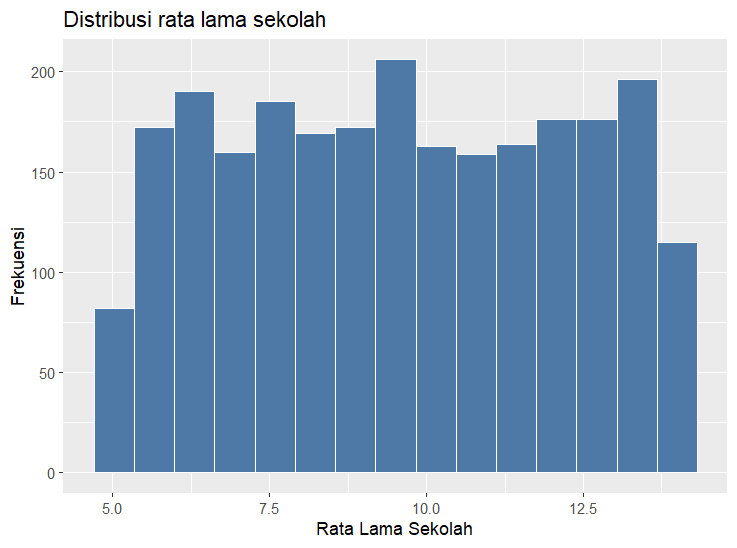
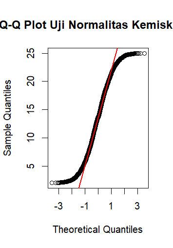
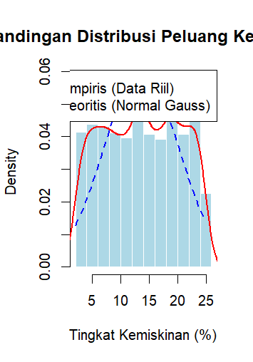

```{r setup, include=FALSE}
knitr::opts_chunk$set(echo = FALSE)
```

```{r include=FALSE}
data <- read.csv("../dataset/pembangunan_wilayah_missing_outlier.csv")
```

## Latar belakang

Kemiskinan merupakan salah satu indikator penting dalam menilai tingkat kesejahteraan masyarakat suatu wilayah. Faktor seperti rata-rata lama sekolah diduga memiliki hubungan dengan persentase kemiskinan. Oleh karena itu, penelitian ini bertujuan menganalisis hubungan kedua faktor tersebut terhadap tingkat kemiskinan menggunakan bahasa pemrograman R.

## Tujuan

Analisis ini bertujuan memahami karakteristik data pembangunan wilayah melalui eksplorasi, statistika deskriptif, visualisasi data, identifikasi missing value dan outlier, serta analisis hubungan antar variabel untuk menghasilkan kesimpulan yang dapat dikomunikasikan secara sistematis dalam bentuk laporan ilmiah.

## Deskripsi Dataset

Dataset yang digunakan dalam analisis ini adalah *pembangunan_wilayah_missing_outlier.csv*, yang berisi informasi pembangunan wilayah pada tingkat kabupaten/kota di Indonesia. Variabel yang dianalisis mencakup identitas wilayah (wilayah, provinsi, dan tahun) serta berbagai indikator sosial-ekonomi, seperti PDRB per kapita, kemiskinan, pengangguran, IPM, harapan hidup, rata-rata lama sekolah, akses internet, kondisi jalan, dan akses air bersih. Selain itu, dataset juga memuat informasi kualitas data melalui variabel *catatan_data* yang menunjukkan keberadaan missing value atau outlier.

## Tools

Proyek ini menggunakan bahasa pemrograman R dan RStudio sebagai lingkungan utama untuk analisis data statistik. Pengolahan dan visualisasi data dilakukan dengan bantuan library *dplyr* untuk manipulasi data serta *ggplot2* untuk pembuatan grafik dan visualisasi. Selain itu, GitHub digunakan sebagai repositori untuk pengelolaan versi kode dan dokumen secara kolaboratif.

## Metode Analisis

Analisis data dilakukan menggunakan bahasa pemrograman R melalui beberapa tahapan, yaitu statistika deskriptif untuk menggambarkan karakteristik data, pra-pemrosesan data yang mencakup penanganan missing value dengan imputasi median dan penghapusan outlier menggunakan metode IQR, serta visualisasi data menggunakan berbagai grafik eksploratif. Selanjutnya, dilakukan analisis korelasi Pearson untuk menguji hubungan antara rata-rata lama sekolah dan tingkat pengangguran terhadap tingkat kemiskinan. Tahap akhir meliputi analisis probabilitas dan distribusi data melalui histogram, kurva densitas, dan Q-Q Plot untuk mengevaluasi pola sebaran data serta asumsi kenormalannya.

## Statistika Deskriptif

Analisis statistika deskriptif dilakukan terhadap seluruh variabel numerik dalam dataset dengan menghitung ukuran pemusatan dan penyebaran data, seperti mean, median, minimum, maksimum, kuartil, standar deviasi, dan varians. Hasil analisis menunjukkan bahwa variabel *pdrb_perkapita* memiliki nilai rata-rata tertinggi, yaitu sebesar 135.650.500, yang menandakan skala nilainya jauh lebih besar dibandingkan variabel lainnya. Variabel ini juga memiliki standar deviasi terbesar (89.341.270) dan varians sebesar 7,98 × 10¹⁵, sehingga menunjukkan adanya variasi yang sangat besar antar wilayah. Selain itu, rentang data yang sangat lebar, yaitu dari 15.031.581 hingga 1.774.545.000, mengindikasikan distribusi data yang tidak sepenuhnya normal serta kemungkinan adanya nilai ekstrem (*outlier*) yang memengaruhi sebaran data.

## Missing Value

*Missing value* merupakan data yang seharusnya diperoleh saat proses pengumpulan data, tetapi tidak tersedia karena berbagai faktor, seperti responden yang tidak menjawab seluruh pertanyaan, kesalahan pengukuran, atau kesalahan pada proses entri data (Kaiser, 2014). Untuk menangani permasalahan tersebut, digunakan metode *median imputation*, yaitu mengganti nilai yang hilang dengan nilai median dari variabel yang bersangkutan (Alam et al., 2023). Pada dataset yang dianalisis, beberapa variabel mengandung *missing value*, sehingga dilakukan perhitungan median pada masing-masing variabel dan nilai tersebut digunakan untuk mengisi data yang hilang.

## Outlier

*Outlier* merupakan nilai ekstrem yang berada di luar pola distribusi normal suatu variabel (Kwak dan Kim, 2017). Untuk menanganinya, digunakan metode *trimming*, yaitu menghapus data *outlier* dari dataset, karena jumlah *outlier* yang ditemukan relatif sedikit sehingga tidak memberikan pengaruh yang signifikan terhadap keseluruhan data. Pada dataset ini terdapat 15 *outlier* yang tersebar pada variabel *pdrb_perkapita*, *kemiskinan*, dan *pengangguran* (masing-masing 5 *outlier*), sehingga setelah proses *trimming* jumlah observasi berkurang dari 2500 menjadi 2485.

## Visualisasi


## Visualisasi


## Visualisasi



## Visualisasi


## Visualisasi


## Distribusi Data



## Distribusi Data



## Korelasi


## Korelasi


## Interpretasi

Penjelasan lebih lanjut mengenai korelasi antara variabel kemiskinan dan rata lama sekolah akan dibahas lebih lanjut dibagian interpretasi.

H~0~ = 0 (Nilai korelasi antara kemiskinan dan rata lama sekolah tidak bernilai signifikan dari 0)

H~1~ ≠ 0 (Nilai korelasi antara kemiskinan dan rata lama sekolah bernilai signifikan dari 0)

Hasil analisis :

Nilai p-value melebih dari nilai yang ditentukan yaitu 0.05 (5%) sehingga bisa dinyatakan bahwa kita gagal menolak pernyataan H~0.~ tidak terdapat cukup bukti untuk menyatakan adanya pengaruh signifikan antara variabel **kemiskinan** dengan **rata lama sekolah**.

## Kesimpulan Utama

Berdasarkan hasil analisis, dataset pembangunan wilayah mengandung *missing value* dan *outlier* yang ditangani menggunakan *median imputation* dan *trimming* berbasis IQR. Proses pembersihan data terbukti efektif, ditunjukkan oleh penurunan nilai maksimum kemiskinan dari 67,53% menjadi 25,00% serta distribusi kemiskinan yang menjadi lebih mendekati normal berdasarkan histogram dan Q-Q Plot. Hasil uji korelasi Pearson menunjukkan nilai *p-value* \> 0,05 sehingga tidak terdapat bukti statistik yang cukup untuk menyatakan adanya hubungan signifikan antara tingkat kemiskinan dan rata-rata lama sekolah pada dataset ini.

## Insight

Hasil analisis menunjukkan masih adanya kesenjangan pembangunan antarwilayah, terutama antara wilayah di Pulau Jawa dan luar Jawa. Keberadaan *missing value* dan *outlier* juga menegaskan pentingnya tahap *data pre-processing* sebelum analisis dilakukan. Meskipun hubungan antara kemiskinan dan rata-rata lama sekolah tidak signifikan secara statistik, arah hubungan yang ditemukan tetap sesuai dengan teori dan mengindikasikan bahwa kemiskinan dipengaruhi oleh berbagai faktor lain, seperti infrastruktur, akses internet, dan layanan kesehatan.

## Saran

Pemerintah daerah disarankan untuk meningkatkan investasi pada sektor pendidikan serta memperluas pemerataan infrastruktur, akses internet, dan layanan kesehatan guna mendukung pengurangan tingkat kemiskinan. Untuk penelitian selanjutnya, disarankan menggunakan analisis regresi berganda yang melibatkan lebih banyak variabel agar faktor-faktor yang memengaruhi kemiskinan dapat dijelaskan secara lebih komprehensif.
