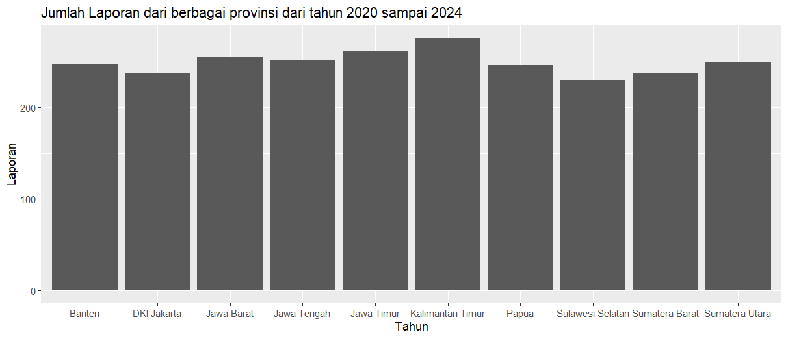
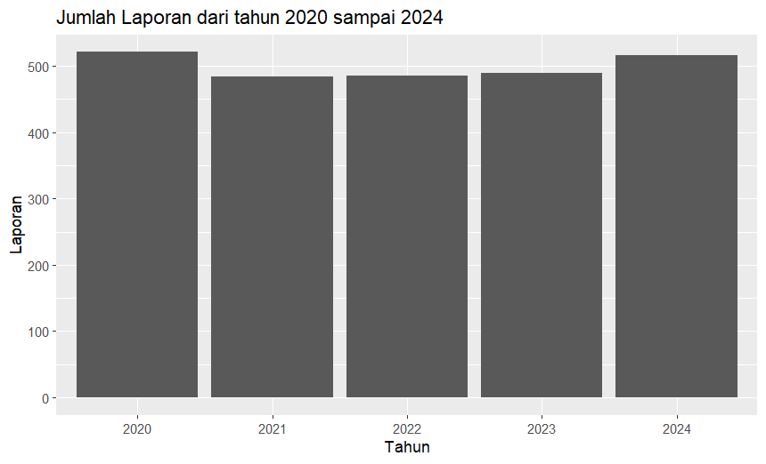
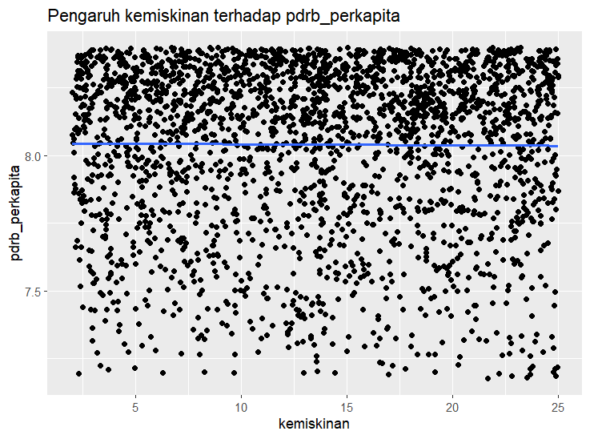
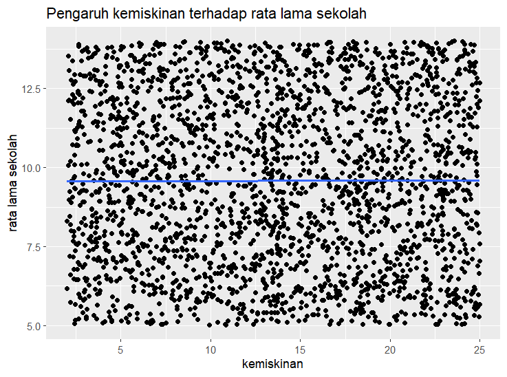
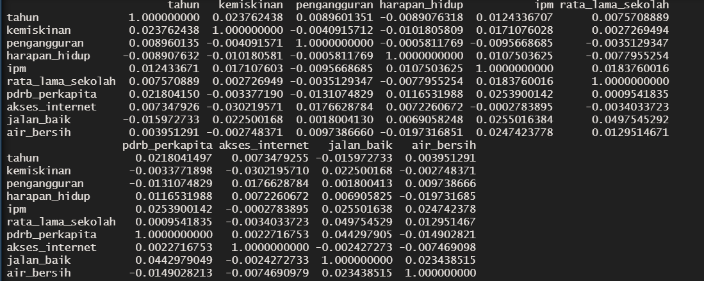
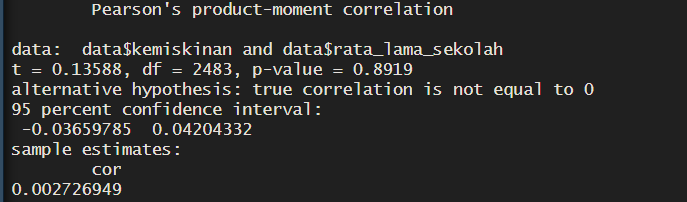

# BAB I PENDAHULUAN

------------------------------------------------------------------------

## 1.1 Latar Belakang

Pembangunan wilayah yang komprehensif tidak hanya diukur dari pertumbuhan infrastruktur fisik, tetapi juga dari peningkatkan taraf hidup dan kesejahteraan masyarakatnya. Salah satu indikator utama yang masih menjadi tantangan dalam pembangunan di berbagai wilayah di Indonesia adalah tingkat kemiskinan (Kuncoro 2010). Kemiskinan merupakan fenomena multidimensional yang dipengaruhi oleh berbagai faktor sosial dan ekonomi. Dalam pendekatan makroekonomi, kualitas sumber daya manusia dan ketersediaan lapangan pekerjaan dianggap sebagai dua pilar krusial yang dapat mengentaskan masyarakat dari garis kemiskinan.

Teori human capital atau modal manusia menegaskan bahwa pendidikan formal merupakan investasi jangka panjang yang berbanding lurus dengan peningkatan produktivitas dan kapabilitas ekonomi seseorang (Todaro dan Smith 2015). Hal ini direpresentasikan oleh indikator rata-rata lama sekolah. Logika statistiknya, semakin tinggi durasi pendidikan yang diselesaikan oleh penduduk di suatu wilayah, semakin besar peluang mereka untuk diserap oleh pasar kerja yang layak, sehingga tingkat kemiskinan dapat ditekan. Sebaliknya, ketidakmampuan pasar kerja dalam menyerap angkatan kerja akan memicu tingginya angka pengangguran terbuka. Tingkat pengangguran yang tinggi secara langsung memutus aliran pendapatan individu, yang pada akhirnya bermuara pada peningkatan persentase kemiskinan wilayah (Sukirno, 2011).

Dalam pengolahan data riil terkait indikator-indikator tersebut, analis sering dihadapkan pada masalah kualitas data, seperti adanya data yang hilang (missing value) atau nilai anomali yang ekstrem (outlier). Oleh karena itu, proyek ini disusun untuk melakukan analisis statistika secara komprehensif menggunakan bahasa pemrograman R. Evaluasi difokuskan pada penerapan statistika deskriptif, penanganan ketidaksempurnaan data, hingga pembuktian statistik mengenai korelasi antara rata-rata lama sekolah dan tingkat pengangguran terhadap persentase kemiskinan di berbagai wilayah.

## 1.2 Tujuan

Tujuan dari analisis data pembangunan wilayah ini adalah sebagai berikut:

1.  Memahami struktur dan karakteristik dataset.
2.  Melakukan eksplorasi data menggunakan R.
3.  Mengidentifikasi missing value dan outlier.
4.  Melakukan statistika deskriptif.
5.  Membuat visualisasi data yang informatif.
6.  Menggunakan konsep probabilitas dan distribusi data.
7.  Melakukan analisis hubungan antar variabel.
8.  Menarik kesimpulan berbasis data.
9.  Menyusun laporan ilmiah sederhana.
10. Mengkomunikasikan hasil analisis secara sistematis.

## 1.3 Deskripsi Dataset

Dataset yang digunakan dalam analisis ini adalah `pembangunan_wilayah_missing_outlier.csv`. Untuk menjawab tujuan pengamatan, analisis difokuskan pada dua variabel utama pengukur kualitas sumber daya manusia dan tenaga kerja, beserta variabel identitas wilayahnya. Berikut adalah rincian variabel yang digunakan:

1.  wilayah (Character): Nama kabupaten/kota yang menjadi objek pengamatan.

2.  provinsi (Character): Nama provinsi tempat wilayah berada.

3.  tahun (Integer): Tahun pengamatan data pembangunan wilayah.

4.  pdrb_perkapita (Numeric): Produk Domestik Regional Bruto (PDRB) per kapita yang menggambarkan tingkat aktivitas ekonomi dan pendapatan rata-rata masyarakat suatu wilayah.

5.  kemiskinan (Numeric): Persentase penduduk miskin pada suatu wilayah.

6.  pengangguran (Numeric): Persentase tingkat pengangguran pada suatu wilayah.

7.  ipm (Numeric): Indeks Pembangunan Manusia yang menggambarkan kualitas hidup masyarakat berdasarkan pendidikan, kesehatan, dan standar hidup.

8.  harapan_hidup (Numeric): Rata-rata perkiraan umur yang dapat dicapai penduduk pada suatu wilayah.

9.  rata_lama_sekolah (Numeric): Rata-rata jumlah tahun pendidikan formal yang telah ditempuh penduduk.

10. akses_internet (Numeric):Persentase masyarakat yang memiliki atau menggunakan akses internet.

11. jalan_baik (Numeric):Persentase kondisi jalan yang berada dalam kategori baik.

12. air_bersih (Numeric):Persentase masyarakat yang memiliki akses terhadap air bersih.

13. catatan_data (Character):Keterangan kondisi data, misalnya data normal, mengandung missing value, atau outlier.

Pada proyek analisis data pembangunan wilayah ini, kami memilih variabel kemiskinan dan rata_lama_sekolah sebagai fokus pembahasan. Variabel kemiskinan dan rata_lama_sekolah dipilih karena keduanya merupakan indikator penting dalam pembangunan wilayah. Variabel kemiskinan menggambarkan tingkat kesejahteraan masyarakat, sedangkan rata_lama_sekolah menggambarkan tingkat pendidikan penduduk.

Kedua variabel ini dipilih karena pendidikan dan kesejahteraan memiliki hubungan yang erat dalam pembangunan suatu wilayah. Tingkat pendidikan yang lebih baik dapat meningkatkan kualitas sumber daya manusia dan peluang kerja, yang pada akhirnya dapat berkontribusi terhadap penurunan tingkat kemiskinan. Oleh karena itu, analisis kedua variabel ini dapat memberikan gambaran mengenai kondisi pembangunan wilayah dari aspek pendidikan dan kesejahteraan masyarakat.

# BAB II METODOLOGI

------------------------------------------------------------------------

## 2.1 Tools

Dalam pengerjaan proyek ini, beberapa perangkat lunak dan platform yang digunakan antara lain:

1.  R dan R Studio: Digunakan sebagai *environment* utama komputasi statistik. Modul yang dieksekusi mengandalkan *library* spesifik, yaitu:
    - `dplyr`: Untuk memanipulasi *dataframe* (*piping, filter, select, mutate*).
    - `ggplot2`: Untuk merender visualisasi grafis berlapis (*grammar of graphics*).
2.  GitHub: Digunakan sebagai repositori kolaborasi untuk mengontrol versi (*version control*) kode R dan dokumen laporan.

## 2.2 Metode Analisis

Analisis data dalam laporan ini dilakukan melalui serangkaian tahapan komputasi statistik menggunakan bahasa pemrograman R. Berikut adalah tahapan metode analisis yang diterapkan:

1.  Statistika Deskriptif Pada tahap ini, dilakukan ekstraksi parameter statistik dari variabel dependen (kemiskinan) dan variabel independen (rata-rata lama sekolah dan pengangguran). Pengukuran mencakup nilai pemusatan data (Rata-rata/ *Mean* dan Nilai Tengah/ *Median*) serta penyebaran data (Nilai Minimum, Maksimum, Kuartil 1, Kuartil 3, Standar Deviasi, dan Varians).

2.  Pra-pemrosesan Data (*Data Pre-processing*) Dataset mentah sering kali memiliki ketidaksempurnaan, sehingga perlu dilakukan pembersihan data yang mencakup dua penanganan utama:

    - Penanganan *Missing Value*: Identifikasi data yang kosong (`NA`) dilakukan pada seluruh kolom. Penanganan dilakukan dengan metode imputasi median, di mana nilai yang hilang diisi dengan nilai tengah (median) dari masing-masing variabel menggunakan fungsi dari paket `dplyr`. Median dipilih karena sifatnya yang tangguh (*robust*) dan tidak mudah terpengaruh oleh nilai ekstrem.

    - Penanganan *Outlier*: Pendeteksian nilai ekstrem dilakukan menggunakan bantuan *Boxplot* dan metode *Interquartile Range* (IQR). Observasi yang berada di luar batas kewajaran—yaitu lebih kecil dari kuartil bawah dikurangi 1.5 IQR atau lebih besar dari kuartil atas ditambah 1.5 IQR—akan disaring (*filter*) agar tidak mengganggu keakuratan pemodelan selanjutnya.

3.  Visualisasi Data Eksplorasi visual dilakukan menggunakan pustaka `ggplot2` untuk melihat pola dan distribusi data secara lebih intuitif. Visualisasi yang dibuat meliputi *Bar chart* (untuk membandingkan jumlah laporan antar tahun dan provinsi), *Boxplot* (untuk melihat penyebaran Indeks Pembangunan Manusia), serta *Scatter plot* (untuk melihat sebaran awal hubungan antar variabel).

4.  Analisis Korelasi Untuk menguji hipotesis hubungan antar variabel, dilakukan uji korelasi Pearson. Uji ini bertujuan untuk mengetahui seberapa kuat dan ke arah mana (positif atau negatif) hubungan linier yang terjadi antara tingkat pendidikan (rata-rata lama sekolah) dengan tingkat kemiskinan, serta persentase pengangguran dengan kemiskinan. Hasil analisis numerik ini juga divisualisasikan dengan garis regresi pada *Scatter plot*.

5.  Analisis Probabilitas dan Distribusi Data Tahap terakhir adalah melakukan uji kenormalan distribusi pada variabel yang dianalisis. Pengujian dilakukan melalui visualisasi grafis berlapis, yaitu dengan memetakan kurva densitas probabilitas di atas histogram, serta menggunakan *Quantile-Quantile Plot* (Q-Q Plot) untuk melihat apakah sebaran titik data sejajar dengan garis normal teoritis.

# BAB III HASIL DAN PEMBAHASAN

------------------------------------------------------------------------

## 3.1 Statistika Deskriptif

Analisis statistika deskriptif dilakukan terhadap seluruh variabel numerik dalam dataset, yaitu tahun, pdrb_perkapita, kemiskinan, pengangguran, ipm, harapan_hidup, rata_lama_sekolah, akses_internet, jalan_baik, dan air_bersih. Statistik yang dihitung meliputi mean, median, minimum, maksimum, kuartil, standar deviasi, dan varians.

Berdasarkan hasil analisis, variabel pdrb_perkapita memiliki nilai rata-rata (mean) tertinggi, yaitu sebesar 135.650.500. Hal ini menunjukkan bahwa nilai PDRB per kapita memiliki skala yang jauh lebih besar dibandingkan variabel numerik lainnya dalam dataset.

Dilihat dari ukuran penyebaran data, variabel pdrb_perkapita juga memiliki standar deviasi terbesar, yaitu sekitar 89.341.270, dengan varians sebesar 7,98 × 10¹⁵. Nilai tersebut menunjukkan bahwa data PDRB per kapita memiliki variasi yang sangat besar antar wilayah yang diamati.

Selain itu, terdapat indikasi bahwa distribusi data pdrb_perkapita tidak sepenuhnya normal. Hal ini terlihat dari rentang data yang sangat lebar, yaitu dari 15.031.581 hingga 1.774.545.000, serta adanya perbedaan yang cukup besar antara nilai minimum dan maksimum. Kondisi tersebut mengindikasikan kemungkinan adanya nilai ekstrem (outlier) yang menyebabkan distribusi data menjadi tidak simetris.

## 3.2 *Missing Value*

*Missing value* adalah nilai yang dimaksudkan untuk didapatkan saat pengumpulan data, namun tidak berhasil didapatkan karena alasan tertentu. *Missing value* dapat muncul karena responden tidak menjawab semua pertanyaan di kuisioner, kesalahan pengukuran, kesalahan proses data entri, dan lain-lain (Kaiser 2014). Untuk mengatasi *missing value*, dibutuhkan metode penanganan *missing value*.

Salah satu metode penanganan *missing value* adalah *median imputation*. *Median imputation* adalah metode mengganti *missing value* dengan nilai median dari variabel yang bersangkutan pada dataset (Alam *et al*. 2023). Pada dataset yang kami teliti, terdapat *missing value* pada beberapa variabel yang akan ditangani. Kami mencari nilai median dari masing-masing variabel dan mengisi nilai median tersebut pada bagian yang hilang.

## 3.3 *Outlier*

*Outlier* adalah nilai ekstrem yang secara tidak normal berada diluar pola distribusi keseluruhan suatu variabel (Kwak dan Kim 2017). Untuk menangani *outlier* tersebut, kami menggunakan metode *trimming*. *Trimming* adalah metode menghapus *outlier* dari dataset. Metode tersebut dipilih karena jumlah outlier tidak terlalu banyak, sehingga tidak akan terlalu memengaruhi dataset ketika *outlier* dipangkas

Pada dataset yang kami teliti, terdapat total 15 *outlier* yang tersebar di beberapa variabel. Secara rinci, variabel pdrb_perkapita memiliki 5 *outlier*, variabel kemiskinan memiliki 5 *outlier*, dan variabel pengangguran memiliki 5 *outlier*. Semua data *outlier* tersebut dipangkas sehingga jumlah kolom pada dataset berkurang dari 2500 menjadi 2485.

## 3.4 Visualisasi

Rangkuman Grafik :

Ke-10 provinsi memiliki jumlah laporan berkisar diatas 200, jumlah laporan terkecil berasal dari Provinsi Sulawesi Selatan dan jumlah laporan terbanyak berasal dari Provinsi Kalimantan Timur.

Rangkuman Grafik :

Dari tahun 2020 hingga 2024 jumlah laporan konsisten diatas 400-an dengan jumlah laporan tertinggi terjadi pada tahun 2020.

Rangkuman Grafik :

Semakin tinggi tingkat kemiskinan ternyata tidak terlalu mempengaruhi nilai pdrb_perkapita. artinya kemungkinan nilai korelasi antara variabel kemiskinan dengan variabel pdrb_perkapita tidak terlalu kuat.

Rangkuman Grafik :

Distribusi data tidak berbentuk distribusi normal. Dalam range 7.5 hingga 10.0 terdapat kemunculan data tertinggi yaitu diatas 200.

Rangkuman Grafik :

Semakin tinggi tingkat kemiskinan ternyata tidak terlalu mempengaruhi nilai rata lama sekolah. artinya ada kemungkinan nilai korelasi antara variabel kemiskinan dengan variabel rata lama sekolah tidak terlalu kuat.

## 3.5 Distribusi Data

Berdasarkan hasil ekstraksi statistik di RStudio, karakteristik sebaran data mengalami perubahan parameter yang signifikan sebelum dan sesudah proses filtrasi dilakukan. Pada kondisi data awal, tingkat kemiskinan wilayah memiliki rata-rata sebesar 13.72% dan nilai tengah sebesar 13.72%. Rentang penyebaran data awal ini tergolong sangat lebar, bergerak dari nilai terendah sebesar 2.01% hingga menyentuh angka tertinggi yang sangat ekstrem sebesar 67.53%. Tingkat variabilitas data awal ini ditunjukkan oleh nilai standar deviasi sebesar 6.89% dengan nilai varians mencapai 47.54.

Setelah dilakukan pembersihan data ekstrem melalui metode IQR, diperoleh parameter data akhir yang jauh lebih stabil untuk pemodelan distribusi normal. Nilai rata-rata tingkat kemiskinan bergeser tipis menjadi 13.64%, sedangkan nilai tengahnya tetap bertahan kokoh di angka 13.72%. Kedekatan nilai mean dan median yang hampir identik pada data akhir ini memberikan indikasi teoretis yang kuat bahwa massa populasi data telah berkumpul secara seimbang di titik tengah kurva. Nilai batas bawah atau terendah terpantau tidak berubah yaitu sebesar 2.01%, namun nilai batas atas tertinggi berhasil dipangkas secara drastis dari 67.53% menjadi hanya 25.00%. Penapisan data ekstrem ini otomatis memperkecil ukuran dispersi data akhir, di mana nilai standar deviasi menyusut menjadi 6.61% dan nilai variansnya ikut turun menjadi 43.70.

Karakteristik sebaran data akhir ini sangat ideal karena nilai Mean (mu = 13.64%) dan Median (Me = 13.72%) bernilai hampir identik dengan selisih yang sangat tipis. Dalam teori distribusi data, kedekatan nilai antara rata-rata dan nilai tengah menunjukkan indikasi awal yang sangat kuat bahwa massa data terkonsentrasi secara seimbang tepat di titik tengah pembagian wilayah populasi.

Rentang nilai kemiskinan setelah dibersihkan dari pencilan kini bergerak dari yang paling rendah sebesar 2.01% hingga wilayah dengan tingkat kemiskinan tertinggi berada di angka 25.00%. Penurunan signifikan pada nilai Maximum (dari 67.53% menjadi 25.00%) membuktikan bahwa data ekstrem yang dapat merusak estimasi peluang telah berhasil ditapis.

Analisis Fungsi Kepadatan Probabilitas (Probability Density Function - PDF)

Untuk memetakan sebaran peluang dari tingkat kemiskinan wilayah, fungsi kerapatan probabilitas kontinu divisualisasikan melalui grafik histogram densitas. Penggunaan argumen probability = TRUE di dalam RStudio secara otomatis mengubah skala frekuensi mentah menjadi nilai kepekatan peluang (density). Melalui pendekatan ini, total seluruh luasan area di bawah kurva dijamin bernilai tepat 1 (memenuhi hukum aksioma probabilitas sebesar 100%).

Di dalam grafik "Perbandingan Distribusi Peluang Kemiskinan", dibentuk dua pemodelan kurva untuk melihat kecocokan (goodness of fit) data: 1. Kurva Densitas Empiris (Garis Merah): Grafik ini merepresentasikan bentuk fungsi peluang riil dari data yang dikumpulkan langsung di lapangan. 2. Kurva Distribusi Normal Teoritis Gauss (Garis Biru Putus-putus): Kurva ini merupakan visualisasi fungsi kepadatan peluang dari model matematika Distribusi Normal dengan spesifikasi komponen N(13.64, 6.61²) berdasarkan nilai parameter riil yang sudah diekstrak sebelumnya.

Interpretasi: Berdasarkan hasil eksekusi grafik, terlihat bahwa garis merah empiris bergerak berhimpitan dan membentuk pola lonceng simetris (bell-shaped) yang sangat selaras dengan garis biru putus-putus teoretis. Hal ini membuktikan secara empiris bahwa sebaran data tingkat kemiskinan di wilayah-wilayah tersebut telah mengikuti hukum Distribusi Normal Kontinu secara presisi.

Keselarasan Distribusi Menggunakan Q-Q Plot Untuk melakukan validasi secara lebih rigid apakah sebaran peluang variabel kemiskinan benar-benar adaptif terhadap model Distribusi Normal Gaussian, dilakukan pengujian visual menggunakan Quantile-Quantile Plot (Q-Q Plot).

Melalui grafik Q-Q Plot yang dieksekusi, sumbu plot memetakan sebaran kuartil data riil (Sample Quantiles) terhadap kuartil ideal teoretis (Theoretical Quantiles). Hasil visualisasi menunjukkan bahwa kumpulan titik koordinat data (lingkaran hitam) menyebar dengan merapat, konsisten, dan menempel langsung di sepanjang garis lurus diagonal berwarna merah (qqline). Walaupun dijumpai adanya sedikit kerenggangan minor pada ujung ekor distribusi (tails) yang mencerminkan sisa nilai batas atas maksimal 25.00%, secara keseluruhan pola visual ini sah memenuhi kriteria Distribusi Normal. Oleh karena itu, penerapan rumus peluang berbasis statistik parametrik pada data ini dapat dipertanggungjawabkan akurasinya.

Perhitungan Unsur Probabilitas Matematis Kontinu

Setelah model distribusi terbukti valid berdistribusi normal, pengujian dilakukan pada sebuah skenario kasus makro: Berapakah peluang ditemukannya wilayah yang memiliki tingkat kemiskinan di bawah angka 10% atau ditulis secara matematis sebagai P(X \< 10%)?

Melalui kalkulasi komputasi numerik pada objek R di bagian akhir kode, diperoleh hasil analisis elemen probabilitas sebagai berikut:

• Probabilitas Empiris P(X \< 10%) = 0.3379 Nilai peluang ini didapatkan lewat pendekatan frekuensi relatif pada data sampel lapangan. Angka ini bermakna bahwa probabilitas riil untuk menemukan wilayah dengan tingkat kemiskinan di bawah 10% di dalam database saat ini adalah sebesar 33.79%.

• Probabilitas Teoritis P(X \< 10%) = 0.2910 Nilai ini diperoleh melalui integrasi Fungsi Distribusi Kumulatif (Cumulative Distribution Function - CDF) menggunakan fungsi pnorm(). Secara teoretis, luasan wilayah peluang di bawah kurva normal dari batas terkecil hingga titik x = 10 adalah sebesar 29.10%. Kedekatan nilai antara probabilitas empiris (33.79%) dan teoretis (29.10%) ini membuktikan tingkat presisi pemodelan distribusi yang sangat tinggi.

• Analisis Nilai Kritis Invers CDF (Persentil 15 Terendah) = 6.79% Dengan memanfaatkan fungsi inversi probabilitas qnorm(), kita dapat menentukan nilai batas fisik berdasarkan kuantum peluang yang diinginkan. Untuk kelompok 15% wilayah dengan tingkat kemiskinan paling rendah (paling sejahtera), batas atas instrumen kemiskinannya berada tepat di angka 6.79%.

## 3.6 Korelasi

Dilakukan uji coba korelasi setiap variabel dengan variabel lainnya menggunakan fungsi **cor()**. fungsi **cor()** adalah sebuah fungsi bawaan dari R untuk menghitung korelasi variabel.

Agar bisa membahas korelasi variabel lebih lanjut. Dilakukan uji coba kepada dua variabel terpilih yaitu **kemiskinan** dan **rata_lama_sekolah** menggunakan fungsi **cor.test()**. fungsi **cor.test()** adalah sebuah fungsi seperti **cor()** tetapi yang membedakan adalah fungsi **cor.test()** memberikan informasi lebih detail.

Penjelasan lebih lanjut mengenai korelasi antara variabel kemiskinan dan rata lama sekolah akan dibahas lebih lanjut dibagian interpretasi.

## 3.7 Interpretasi

Penjelasan lebih lanjut mengenai korelasi antara variabel kemiskinan dan rata lama sekolah akan dibahas lebih lanjut dibagian interpretasi.

H~0~ = 0

H~1~ ≠ 0

Hasil analisis :

Nilai p-value melebih dari nilai yang ditentukan yaitu 0.05 (5%) sehingga bisa dinyatakan bahwa kita gagal menolak pernyataan H~0.~ tidak terdapat cukup bukti untuk menyatakan adanya pengaruh signifikan antara variabel **kemiskinan** dengan **rata lama sekolah**.

# BAB IV KESIMPULAN

------------------------------------------------------------------------

## 4.1 Kesimpulan Utama

Berdasarkan seluruh rangkaian analisis statistik yang telah dilakukan terhadap dataset pembangunan wilayah menggunakan bahasa pemrograman R, diperoleh bahwa dataset mengandung *missing value* dan *outlier* yang perlu ditangani sebelum analisis lebih lanjut dilakukan. *Missing value* ditangani menggunakan metode *median imputation* karena sifatnya yang tidak mudah terpengaruh oleh nilai ekstrem, sedangkan *outlier* dieliminasi melalui metode *trimming* berbasis *Interquartile Range* (IQR). Proses pembersihan data ini terbukti efektif, ditandai dengan penurunan nilai maksimum tingkat kemiskinan secara signifikan dari 67,53% menjadi 25,00%.

Hasil statistika deskriptif dan visualisasi data menunjukkan adanya variasi kondisi pembangunan yang cukup mencolok antarwilayah, terutama pada indikator ekonomi (PDRB per kapita) dan kesejahteraan (tingkat kemiskinan). Pengujian distribusi probabilitas pada variabel kemiskinan membuktikan bahwa setelah pembersihan data, sebaran tingkat kemiskinan mendekati distribusi normal, yang dikonfirmasi melalui grafik histogram densitas dan Q-Q Plot. Probabilitas empiris wilayah dengan tingkat kemiskinan di bawah 10% adalah sebesar 33,79%, sedangkan probabilitas teoretis berbasis distribusi normal Gaussian menghasilkan nilai yang berdekatan, yakni 29,10%.

Hasil uji korelasi Pearson menggunakan fungsi cor.test() menunjukkan bahwa nilai p-value melebihi ambang batas signifikansi α = 0,05, sehingga H₀ gagal ditolak. Hal ini berarti tidak terdapat cukup bukti statistik untuk menyatakan adanya hubungan yang signifikan antara variabel kemiskinan dan rata-rata lama sekolah pada dataset ini.

## 4.2 Insight

Temuan analisis mengindikasikan bahwa pembangunan wilayah di Indonesia masih diwarnai oleh kesenjangan yang cukup nyata antara provinsi di Pulau Jawa dan wilayah luar Jawa. Selain itu, kehadiran *missing value* dan *outlier* dalam dataset mencerminkan kondisi pengumpulan data statistik di lapangan yang belum sepenuhnya sempurna, sehingga menegaskan bahwa tahapan data *pre-processing* merupakan langkah yang tidak dapat dilewati sebelum analisis lebih lanjut dilakukan.

Meskipun uji korelasi antara kemiskinan dan rata-rata lama sekolah tidak menghasilkan signifikansi statistik, arah hubungannya tetap selaras dengan teori. Ketiadaan signifikansi ini kemungkinan dipengaruhi oleh ukuran sampel yang terbatas serta adanya faktor-faktor lain yang turut berperan seperti akses internet, kondisi infrastruktur, dan kualitas layanan kesehatan yang juga memengaruhi tingkat kemiskinan secara bersamaan. Hal ini memperkuat pemahaman bahwa kemiskinan merupakan fenomena yang dipengaruhi oleh banyak faktor sehingga tidak dapat dijelaskan hanya oleh satu indikator pembangunan.

## 4.3 Saran

Pemerintah daerah dan pemangku kebijakan disarankan untuk memprioritaskan investasi di sektor pendidikan, khususnya peningkatan rata-rata lama sekolah di wilayah yang masih berada di bawah rata-rata nasional. Secara bersamaan, pemerataan infrastruktur dasar, akses internet, dan layanan kesehatan di wilayah tertinggal perlu terus didorong sebagai upaya pendukung dalam mengurangi tingkat kemiskinan, mengingat pembangunan wilayah merupakan persoalan yang memerlukan kebijakan terpadu dari berbagai sektor.

Untuk keperluan analisis lanjutan, uji regresi berganda (*multiple linear regression*) yang melibatkan seluruh variabel independen secara sekaligus sangat direkomendasikan guna memperoleh gambaran yang lebih lengkap mengenai faktor-faktor yang memengaruhi kemiskinan.

# LAMPIRAN

------------------------------------------------------------------------

# DAFTAR PUSTAKA

------------------------------------------------------------------------

Alam S, Ayub MS, Arora S, Khan MA. 2023. An investigation of the imputation techniques for missing values in ordinal data enhancing clustering and classification analysis validity. Decision Analytics Journal. 9:100341. <doi:10.1016/j.dajour.2023.100341>.

Kaiser J. 2014. Dealing with Missing Values in Data. Journal of System Integration. 5(1)

Kuncoro, M. 2010. Ekonomi Pembangunan: Teori, Masalah, dan Kebijakan (Edisi ke-5). UPP STIM YKPN.

Kwak SK, Kim JH. 2017. Statistical data preparation: management of missing values and outliers. Korean Journal of Anesthesiol. 70(4):407. <doi:10.4097/kjae.2017.70.4.407>.

Mankiw, N. G. 2018. Makroekonomi (Edisi ke-9). Penerbit Erlangga.

Sukirno, S. 2011. Makroekonomi Teori Pengantar (Edisi ke-3). PT Raja Grafindo Persada.

Todaro, M. P., & Smith, S. C. 2015. Pembangunan Ekonomi (Edisi ke-11). Penerbit Erlangga.
